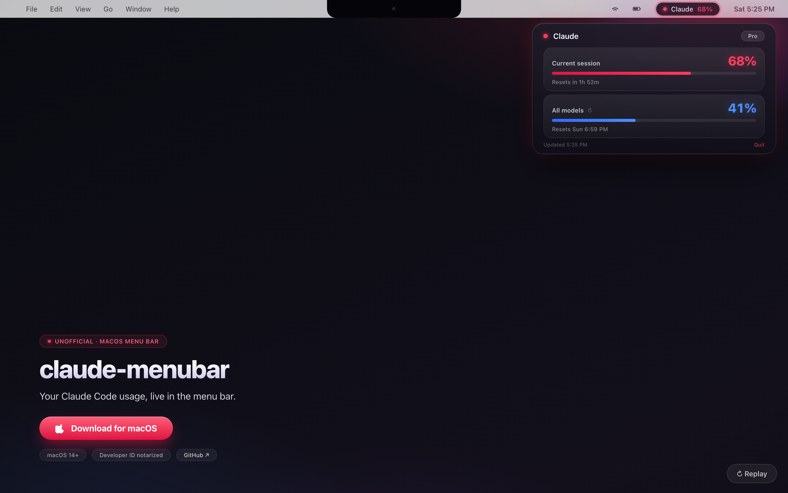

# (macOS) claude-menubar

An unofficial macOS menu bar utility for viewing Claude Code usage in real time.

`claude-menubar` shows current session and weekly usage, updates from Claude Code rate limit data, and stays out of the Dock.

[](https://cwlee0911.github.io/claude-menubar/)
[](https://cwlee0911.github.io/claude-menubar/)

## Features

- Shows current session and weekly usage.
- Updates from Claude Code rate limit data.
- Runs as a menu bar app with no Dock icon.
- Preserves an existing Claude Code `statusLine.command` when possible.

## Download

Download the latest DMG from the badge above, open it, and drag `claude-menubar.app` to Applications.

Release DMGs are Developer ID signed and include an Applications shortcut.

## Requirements

- macOS 14+
- Xcode, for building from source
- `jq` recommended

## Build from Source

```bash
./script/build_and_run.sh
```

## Release

```bash
./script/package_release.sh
```

## How It Works

On launch, the app installs a small Claude Code `statusLine` bridge script. The bridge writes usage data to:

```text
~/Library/Application Support/ClaudeMenubar/usage.json
```

The menu bar app watches that file and displays the latest limits.

## Disclaimer

This is an independent, unofficial third-party utility. It is not affiliated with, endorsed by, or sponsored by Anthropic.

Claude and Claude Code are referenced only to describe compatibility with Anthropic's products. This project does not use Anthropic logos or brand assets.
